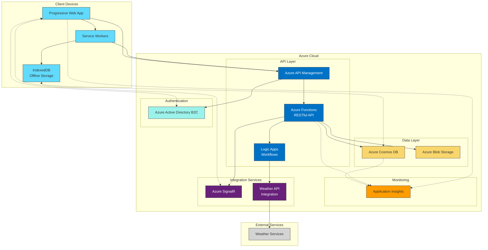

# Arrow Tracker - High-Level Architecture

**Document Date:** April 12, 2025  
**Project Name:** Arrow Tracker  
**Document Version:** 1.0

## Overview
This document outlines the high-level architecture for the Arrow Tracker application as a Progressive Web App (PWA) backed by a cloud-based API running on Azure. The architecture is designed to support the requirements specified in the HighLevelRequirements.md document.

## Architecture Stack

| Layer | Technology | Justification |
|-------|------------|---------------|
| Frontend | Progressive Web App (PWA) | Enables cross-platform functionality with offline capabilities while maintaining a single codebase |
| API Backend | Azure Functions | Serverless architecture provides scalability and cost-efficiency for variable load patterns |
| Database | Azure Cosmos DB | Global distribution, multi-model database with offline sync capabilities |
| Authentication | Azure Active Directory B2C | Secure identity management with social login options |
| Storage | Azure Blob Storage | Cost-effective storage for user-generated content like target images |
| Analytics | Azure Application Insights | Real-time performance monitoring and usage analytics |

## Component Architecture

### Frontend (PWA)

The Progressive Web App will be built using:

| Component | Technology | Purpose |
|-----------|------------|---------|
| UI Framework | React | Component-based architecture for maintainable UI development |
| State Management | Redux | Centralized state management for complex application state |
| Offline Storage | IndexedDB | Client-side storage for offline functionality |
| PWA Features | Service Workers | Enable offline capabilities, background sync, and push notifications |
| UI Components | Material UI | Design system with responsive components optimized for mobile |

### Backend (Azure)

The cloud infrastructure on Azure will consist of:

| Service | Purpose | Features Used |
|---------|---------|--------------|
| Azure Functions | API Backend | HTTP triggers for RESTful API endpoints |
| Azure API Management | API Gateway | Rate limiting, authentication, and monitoring |
| Azure Cosmos DB | Data Storage | Multi-region writes, offline sync via Change Feed |
| Azure Blob Storage | Media Storage | Storing target images and session photos |
| Azure CDN | Content Delivery | Fast delivery of static assets globally |
| Azure Active Directory B2C | Authentication | Social logins, MFA, and custom branding |
| Azure SignalR Service | Real-time Updates | Optional real-time updates for coaching features |
| Azure Logic Apps | Workflow Automation | Weather data integration and notifications |

## Data Architecture

### Primary Entities

| Entity | Description | Storage Location |
|--------|-------------|------------------|
| User Profiles | Archer profiles and preferences | Cosmos DB + AAD B2C |
| Practice Sessions | Metadata about practice sessions | Cosmos DB |
| Ends | Groups of shots with target information | Cosmos DB |
| Shots | Individual arrow shot data | Cosmos DB |
| Equipment | Bow, arrow, and accessory details | Cosmos DB |
| Media | Photos of targets, form videos | Azure Blob Storage |
| Analytics | Performance trends and statistics | Computed/Cosmos DB |

### Data Flow

1. **Online Mode:**
   - User interactions in the PWA trigger API calls to Azure Functions
   - Functions read/write data to Cosmos DB
   - Changes in Cosmos DB trigger relevant calculations or workflows

2. **Offline Mode:**
   - User interactions are stored in IndexedDB
   - Service workers queue API calls for later synchronization
   - On reconnection, background sync resolves conflicts using timestamps

## Scalability Considerations

| Aspect | Approach |
|--------|----------|
| User Growth | Azure Functions auto-scale based on demand |
| Data Volume | Cosmos DB partitioning strategy based on user ID and session date |
| Global Usage | Multi-region deployment with Azure Traffic Manager |
| Peak Loads | Azure Front Door for load balancing during competitions |

## Security Architecture

| Security Aspect | Implementation |
|-----------------|----------------|
| Authentication | Azure AD B2C with MFA option |
| Authorization | Role-based access control (RBAC) |
| Data Encryption | Encryption at rest and in transit |
| API Security | API keys, rate limiting, and IP restrictions |
| Monitoring | Azure Security Center integration |

## Cost Optimization

| Service | Optimization Strategy |
|---------|----------------------|
| Azure Functions | Consumption plan for cost-effective scaling |
| Cosmos DB | Request Units (RU) optimization and autoscale |
| Blob Storage | Tiered storage for older media (hot → cool → archive) |
| CDN | Edge caching to reduce API calls |

## DevOps Approach

| Aspect | Tools/Approach |
|--------|----------------|
| Source Control | GitHub Repositories |
| CI/CD | GitHub Actions |
| Project Management | GitHub Projects and Issues |
| Infrastructure as Code | Azure Bicep with GitHub Actions deployment |
| Documentation | GitHub Pages for documentation hosting |
| Monitoring | Application Insights and Log Analytics |
| Testing | Jest for unit tests, Cypress for E2E tests with GitHub Actions runners |
| Code Quality | GitHub Advanced Security, CodeQL, and Dependabot |
| Environment Management | GitHub Environments with protection rules |

### GitHub-Based Development Workflow

```mermaid
graph LR
    %% Development Flow
    DEV[Developer] -->|Commits Code| FEAT[Feature Branch]
    FEAT -->|Pull Request| PR[Code Review]
    PR -->|Automated Tests| GHACT[GitHub Actions]
    GHACT -->|Pass| MERGE[Merge to Main]
    MERGE -->|Trigger| DEPLOY[Deployment Pipeline]
    
    %% Deployment Pipeline
    DEPLOY -->|DEV| DEV_ENV[Development Environment]
    DEV_ENV -->|Approval| STG[Staging Environment]
    STG -->|Approval| PROD[Production Environment]
    
    %% Feedback Loop
    PROD -->|Monitoring| MONITOR[Application Insights]
    MONITOR -->|Issues| ISSUES[GitHub Issues]
    ISSUES --> DEV
    
    %% Infrastructure as Code
    INFRA[Infrastructure Code] -->|Bicep| GHACT
    
    %% Style
    classDef github fill:#24292e,stroke:#333,stroke-width:1px,color:#fff;
    classDef env fill:#0366d6,stroke:#333,stroke-width:1px,color:#fff;
    classDef monitor fill:#FF9D00,stroke:#333,stroke-width:1px;
    
    class FEAT,PR,GHACT,MERGE,ISSUES,INFRA github;
    class DEV_ENV,STG,PROD env;
    class MONITOR monitor;
```

### CI/CD Pipeline Components

| Pipeline Component | Implementation |
|-------------------|----------------|
| Build | GitHub Actions workflows triggered by PRs and commits to main |
| Test | Automated testing including unit, integration, and E2E tests |
| Security Scanning | CodeQL analysis, dependency scanning, and secret detection |
| Deployment | Multi-environment deployment with approval gates |
| Infrastructure | Infrastructure as Code deployment through GitHub Actions |

### Integration with Azure

GitHub Actions will be used to deploy resources to Azure using service principals and managed identities:

1. Azure credentials stored as GitHub Secrets
2. GitHub Actions runners execute Azure CLI and Bicep deployment scripts
3. GitHub Environments map to Azure resource groups for DEV/TEST/PROD

## Future Extensibility

The architecture supports the future considerations outlined in the requirements:

| Future Feature | Architectural Support |
|----------------|----------------------|
| Video Analysis | Azure Video Indexer integration via Azure Functions |
| Coach Collaboration | Azure B2B authentication and shared access policies |
| Equipment Marketplace | Azure API Management for partner integrations |
| Club Management | Multi-tenancy support in Cosmos DB |
| AR Target Projection | WebXR support in the PWA |

---

*This document serves as a high-level architecture outline and will be referenced during the detailed design and implementation phases.*